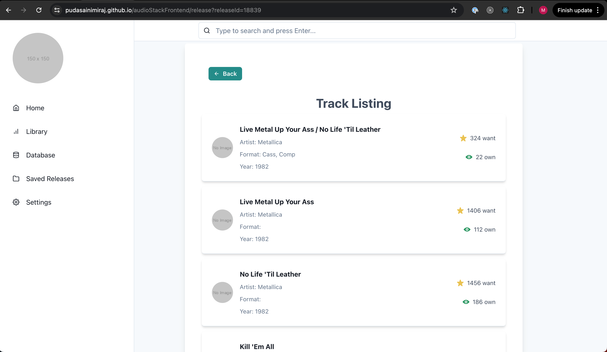

# My Awesome App

## Overview
AudioStackFrontend is a web application that provides users with comprehensive discography data and enables efficient searching and browsing through a clean and intuitive interface. The app leverages the power of Chakra UI for a polished and professional user experience.

## Features
- **Search Functionality**: Quickly find specific releases or artists.
  
- **Detailed Views**: View detailed information about releases and artists.
   
- **Responsive Design**: Optimized for both desktop and mobile devices.
- **Error Handling**: Professional error handling with loading spinners and informative alerts.


## Features to be added
- **Discography Browsing**: Browse through a wide range of music releases.
- **User Authentication**: Add users to the app and have authenticated.
- **Saving Library**: Let users to be able to save their favourite artists and their releases. 
## Technologies Used
- **React**: For building the user interface.
- **TypeScript**: For type safety and improved development experience.
- **Chakra UI**: For a sleek and professional design.
- **Next.js**: For server-side rendering and optimized performance.

### Find the deployed version
The deployed version of the app can be found at https://pudasainimiraj.github.io/audioStackFrontend/ . 

## Getting Started Locally

### Prerequisites
- **Node.js**: Ensure you have Node.js installed. You can download it from [nodejs.org](https://nodejs.org/).

### Installation
1. **Clone the repository**:
    ```bash
    git clone https://github.com/pudasainimiraj/audioStackFrontend.git
    cd audioStackFrontend
    ```

2. **Install dependencies**:
    ```bash
    npm install
    ```

## Running the Application
To start the application, run:
```bash
npm run dev
This will start the development server and you can view the app by navigating to http://localhost:3000 in your browser.
```

## Project Structure
src/components: Contains all the React components used in the app.
buttons: Button components.
cardComponent: Components for displaying release cards.
    - genericCard : Card Component used to render the list of queried artist.
    - releaseCard : Card Component used to render the release page with the release details. 
layouts: Layout components such as Header and Sidebar.
mainComponent.tsx: Main component of the app.
modals: Modal components (e.g., ArtistDetailModal).
searchBar: Search bar components.
hooks: Custom hooks (e.g., useDiscogProvider).
pages: Next.js pages (e.g., index.tsx, release.tsx).
public: Public assets such as images and fonts.


## Contributing
We welcome contributions! Please follow these steps:

1. **Fork the repository**.
2. **Create a new branch** (`git checkout -b feature/YourFeatureName`).
3. **Commit your changes** (`git commit -m 'Add some feature'`).
4. **Push to the branch** (`git push origin feature/YourFeatureName`).
5. **Open a Pull Request**.


### License
This project is licensed under the MIT License. See the LICENSE file for details.
